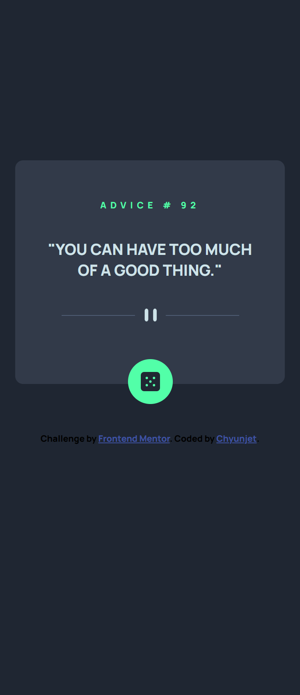
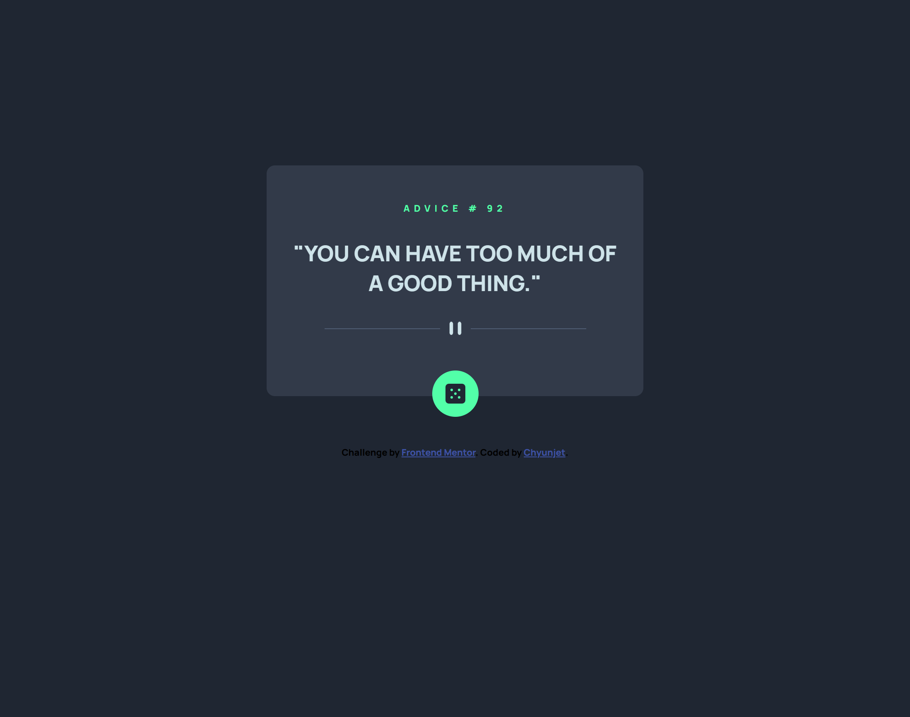

# Frontend Mentor - Advice generator app solution

This is a solution to the [Advice generator app challenge on Frontend Mentor](https://www.frontendmentor.io/challenges/advice-generator-app-QdUG-13db). Frontend Mentor challenges help you improve your coding skills by building realistic projects.

## Table of contents

- [Overview](#overview)
  - [The challenge](#the-challenge)
  - [Screenshot](#screenshot)
  - [Links](#links)
- [My process](#my-process)
  - [Built with](#built-with)
  - [What I learned](#what-i-learned)
  - [Continued development](#continued-development)
  - [Useful resources](#useful-resources)
- [Author](#author)
- [Acknowledgments](#acknowledgments)


## Overview

### The challenge

Users should be able to:

- View the optimal layout for the app depending on their device's screen size
- See hover states for all interactive elements on the page
- Generate a new piece of advice by clicking the dice icon

### Screenshot





### Links

- Solution URL: [Add solution URL here](https://your-solution-url.com)
- Live Site URL: [Add live site URL here](https://your-live-site-url.com)

## My process

### Built with

- Semantic HTML5 markup
- SASS custom properties
- Flexbox
- CSS Grid
- Mobile-first workflow
- SASS
- AJAX
- API

### What I learned


```css (how to make it has glowing effect when hover on it)
.primary_button_bg:hover, .primary_button::before {
  box-shadow: 0px 0px 20px hsl(150deg, 100%, 66%);
}
```
```js (use API with AJAX)
let advice_id= document.querySelector("#advice_id")
let advice_content= document.querySelector("#advice_content")
const btn= document.querySelector("#btn")


ourRequest= new XMLHttpRequest();
ourRequest.open('GET', "https://api.adviceslip.com/advice")
ourRequest.onload = function(){
    let ourData= JSON.parse(ourRequest.responseText);
    advice_id.innerHTML=ourData.slip.id
        advice_content.innerHTML=ourData.slip.advice
    btn.addEventListener("click", ()=>{
        location.reload()
    })
}

ourRequest.send();
```

### Continued development

need to learn how to use API, and practice more on AJAX

### Useful resources

- [JSON and AJAX Tutorial: With Real Examples](https://www.youtube.com/watch?v=rJesac0_Ftw) - Learn how to use AJAX with this video.


## Author

- Frontend Mentor - [@yourusername](https://www.frontendmentor.io/profile/Jetyun)
- Upwork - (https://www.upwork.com/freelancers/~015d35ec2b9993f168)

## Acknowledgments

Thanks LearnWebCode for teaching me how to use AJAX.
